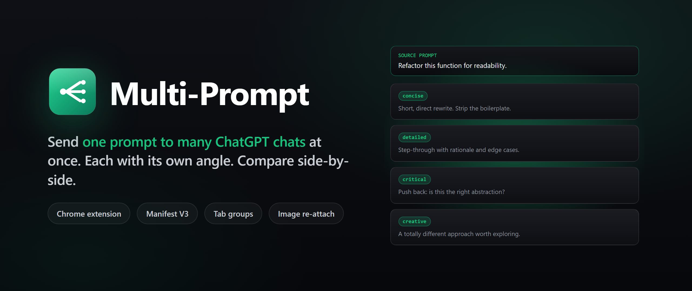
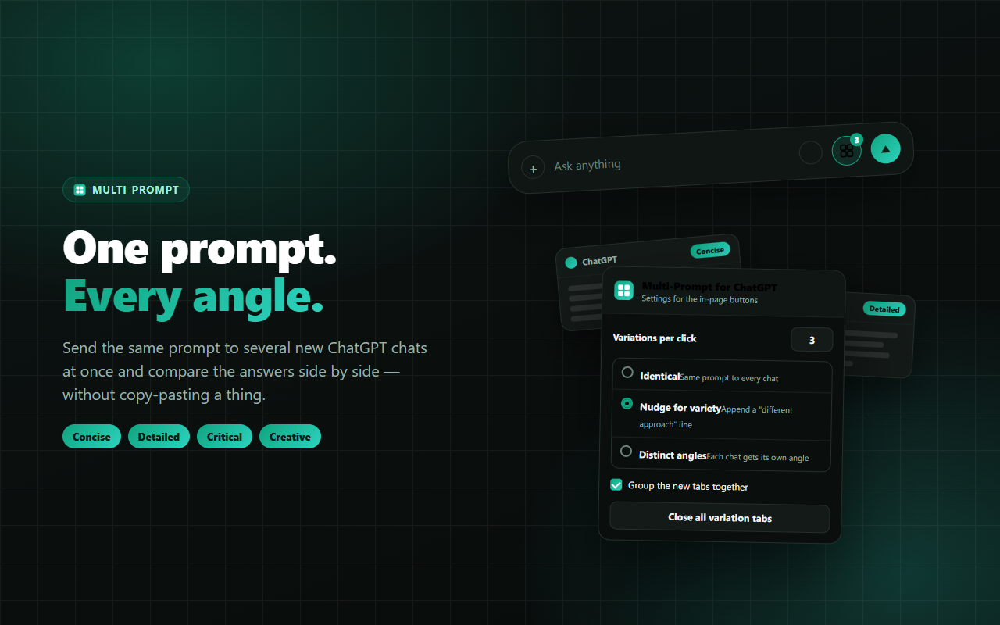

<p align="center">
  
</p>

<h3 align="center">
  Send one prompt to many ChatGPT chats. Compare answers side by side.
</h3>

<p align="center">
  Fan out from the composer with optional variation angles. Re-attaches images. Tab-grouped.
</p>

<p align="center">
  <a href="LICENSE"></a>
  <a href="manifest.json"></a>
  <a href="https://remieldev.github.io/multi-prompt-for-chatgpt/"></a>
</p>

<p align="center">
  
  
  
</p>

---

A Chrome extension that sends **one prompt to several new ChatGPT chats at once** - each optionally with **its own angle** - so you can compare the answers side by side. It works from a button **inside ChatGPT itself**, and re-attaches your images to every new chat.



> Independent project - not affiliated with, endorsed by, or sponsored by OpenAI.

## Features

- **Fan out from the composer.** A grid button next to ChatGPT's Send button opens whatever you're typing (plus attached images) in N new chats.
- **Re-run any past prompt.** A button in each previous message's hover toolbar re-sends that prompt (and its images) to N fresh chats.
- **One prompt, many angles.** Pick a style: *identical*, a *"give a different approach"* nudge, or *distinct angles* per chat (concise, detailed, critical, creative, step-by-step - or your own editable list).
- **Media-safe.** Re-attaches images to every chat and refuses to submit a chat that's missing media, so comparisons are fair.
- **Tidy workspace.** 1-10 chats per click, auto-grouped into one labelled tab group, with a one-click **Close all variation tabs** and keyboard shortcuts.
- **Private.** No account, no tracking, no remote code, no servers. Prompts never touch disk and only ever go to ChatGPT itself.

## Install (unpacked, for development)

1. Open `chrome://extensions`
2. Toggle **Developer mode** (top right)
3. **Load unpacked** and select this folder
4. Pin the extension and open `https://chatgpt.com`

> After editing code, click the reload icon on the extension card.

## Use

1. Click the toolbar icon to set your **count** and **variation style** once.
2. In ChatGPT, type a prompt (attach images if you like) and click the **grid button** next to Send - or hover any past message and click its grid button.
3. The new chats open, each fills itself in, and submits automatically.

Keyboard shortcuts: `Ctrl/Cmd+Shift+1` opens settings · `Ctrl/Cmd+Shift+0` closes all variation tabs.

## How it works

ChatGPT's `?prompt=` URL parameter only **pre-fills** the composer; it no longer auto-submits. So each opened tab must submit itself:

- `background.js` expands your prompt into one string per tab (applying the angle strategy), opens N tabs pre-filled via `?prompt=`, and stores each tab's payload **keyed by that tab's real id** - nothing is smuggled through the URL, and media is stored **once** for the whole fan-out.
- `content.js` (in each new tab) asks the worker for its payload, re-attaches any media and waits for the upload chips to confirm, reconciles the prompt text, waits for uploads to finish, then clicks **Send** (with an Enter-key fallback).

No API keys. No server. The extension rides your existing ChatGPT login, so every chat counts against your own ChatGPT plan.

## Project layout

```
manifest.json            MV3 manifest (permissions, action, commands)
background.js            service worker: opens/groups/closes tabs, relays payloads
content.js               injects buttons + auto-fills/attaches/submits new chats
content.css              in-page button + toast styling
popup.html/.css/.js      the settings UI
icons/                   16/32/48/128 PNG icons
store/
  assets.html            source template for all marketing graphics
  render.js              renders screenshots, promo tiles, and icons via your Chrome
  out/                   generated store assets
  STORE_LISTING.md       copy/paste-ready Chrome Web Store listing
  PRIVACY.md             privacy policy
scripts/pack.js          builds dist/multi-prompt-for-chatgpt.zip
index.html               GitHub Pages landing page
privacy.html             hosted privacy policy
```

## Building store assets

```bash
cd store
npm install            # installs playwright-core (uses your system Chrome)
npm run render         # regenerates everything in store/out/ and icons/
```

`render.js` launches your installed Chrome via `playwright-core`, with no browser download. Override the path with `CHROME_PATH=... node render.js` if needed.

## Packaging for the Web Store

```bash
npm run pack           # from repo root, builds dist/multi-prompt-for-chatgpt.zip
```

Then upload that zip in the [Developer Dashboard](https://chrome.google.com/webstore/devconsole) and fill in the fields from `store/STORE_LISTING.md`.

## Notes and disclaimers

- Not affiliated with OpenAI. "ChatGPT" is a trademark of OpenAI, used here only to describe compatibility.
- The flow depends on ChatGPT's page; if the composer markup changes substantially, update the selectors in `content.js`.

## License

[MIT](LICENSE).
